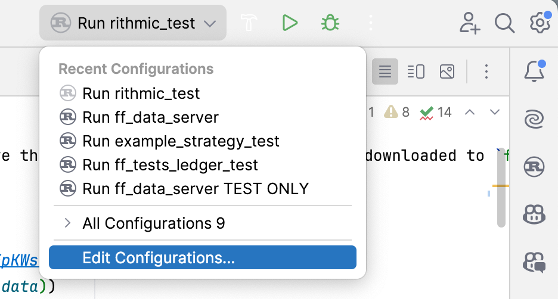

# Fund Forge
Community [discord](https://discord.gg/MNXH2jEExV)

**Fund Forge** is an algorithmic trading engine written in Rust.

Focused on backtesting, live trading and charting (soon). With an emphasis for automated and semi-automated strategies. 

fund-forge is built to allow simple abstractions for common strategy functionality: trade multiple symbols from multiple brokers, with multiple data streams.

<span style="color: red;">***For development and testing purposes only. live trading is in development/testing phase, please monitor live strategies. repo is currently unstable.***</span>

## Limitless Free Historical Data
See below for all the free historical data you will ever need.

### Announcements
- 12-11-24: Added a fix to avoid memory crash when downloading a large amount of high resolution data in short periods.
- 12-11-24: I Added a compression algorithm to reduce the size of files by 98%, a 200mb tick file is now <5mb. This will have a massive impact on the amount of data we can process when running strategies on remote machines.
- 12-11-24: Simplified the way we can subscribe to data, we now have the responsibility to explicitly declare if we want to consolidate from a primary data source or use the subscription as a primary source. [see](ff_standard_lib/src/strategies/STRATEGIES_README.md/#subscriptions)
- 16-11-24: Indicators are no longer an enum, we now pass a `Box<dyn Indicators>` where Indicators is the trait common to all indicators. indicator::new() should return `Box<Self>`. [see](ff_standard_lib/src/strategies/STRATEGIES_README.md/#creating-indicators) The runtime cost of using dyn dispatch here is negligible, and it allows us to build custom indicators without modifying the engine.
- 16-11-24: I added a lot of Ai generated indicators that are not tested.
- 17-11-24: Added consolidators for daily and weekly resolutions (Have not been tested and will need some work to finish off), these need a TradingHours object to be passed in when subscribing to data. [see](ff_standard_lib/src/strategies/STRATEGIES_README.md/#trading-hours), also [see](ff_standard_lib/src/strategies/STRATEGIES_README.md/#subscriptions)
- 20-11-24: Fixed some data base Serialization issues created when adding compression, add unit tests for data base.
- 21-11-24: Starting DataBento Api.
- 21-11-24: Added Trade statistics for high accuracy backtesting and statistics. [see](ff_standard_lib/src/strategies/STRATEGIES_README.md/#statistics)
- 25-11-24: Fixed a Live trading bug related to live warm up that was created during weekend development.
- 25-11-24: Add a strategy.get_front_month() function to allow getting front month `SymbolCode` automatically from rithmic. (in backtesting it is calculated from a map)

### Current State and Future Development
The platform is currently in a semi-working state, think of it as a proof of concept, there is a lot of untested functionality, both in backtesting and live trading.

The core logic is done, but it will be improved and made more readable and resilient.

The first objective was to get everything 'sort of working' so that I could get some practical experience with the engine and brokerage api's and try to establish a consistent pattern.
Now that Oanda and Rithmic are in a sort of working state, I will finish the Bitget api, once the bitget api is complete I will be focused on consolidating the code base into a consistent design pattern, to make maintenance and future api implementations easier.
This step will be done slowly by testing strategies under live and historical conditions, improving functions to handle errors and refactoring as I go to create a simple, easy to understand standard for future integrations.

Oanda: Live is Incomplete.

Rithmic: Working in Live using un-synchronized account mode, but should be monitored or have some sort of trader risk rules set on rithmic side.

Bitget: Not yet implemented.

DataBento: Not yet implemented.

### Initial Setup
1. Install [rust](https://www.rust-lang.org/tools/install).
2. Install OpenSSL, `brew install openssl`.
3. You need to set up a [Rithmic account](ff_data_server/src/rithmic_api/RITHMIC_SETUP.md) or [Oanda account](ff_data_server/src/oanda_api/OANDA_SETUP.md). [Free Historical Data](#historical-data), currently to run a backtest, you need one of these api's active on the server.
4. Put the test data into the correct directory. [instructions below](#file-and-folder-structure)
5. Navigate to [ff_data_server](./ff_data_server) directory and `cargo build` then `cargo run` (don't run the server in your IDE, it will have issues (more issues than normal :) )
    - to run the server with rithmic apis connected use `cargo run -- --rithmic "0"`.
    - to run with only test api use `cargo run -- --rithmic "1"`.
6. Navigate to [example_test_strategy](ff_tests/example_test_strategy) directory and `cargo build` then`cargo run`

*When running a server the working directory must be the ff_data_server directory, or the server will not find its resources' folder.* [see](ff_tests/example_test_strategy/README.md)

*When running a strategy the working directory must be the strategy directory, or the strategy will not find its resources' folder.* [see](ff_tests/example_test_strategy/README.md)

The easiest way to get up and running is to download the repo and open it with [Jetbrains Rust Rover](https://www.jetbrains.com/rust/?_gl=1*132okxr*_gcl_aw*R0NMLjE3MjczMDE0MjAuQ2p3S0NBanc2YzYzQmhBaUVpd0FGMEVIMUJSYkxpU1lmRUdJZkFENGMtbzlWc0FFQnNPaVpTS2cxLUxxaDdDeDZuMXB2ajlUUXpFQWtSb0MxNUVRQXZEX0J3RQ..*_gcl_au*MTgwMzYzMTQwOS4xNzI1MjI3MDMx*_ga*NTkyMTQxNDAyLjE3MjUyMjcwMjc.*_ga_9J976DJZ68*MTcyOTY3MDgzMC44LjEuMTcyOTY3MjQ5NC41OC4wLjA), I have already got the run configurations set up for you.

[If using Rust Rover You might need to change the config directories to your own](#if-using-rust-rover).

⚠️ Warning
If you are using Rithmic, proceed with extreme caution!
Live order functionality is being implemented, and any active strategy may send real orders directly to the market.
If I make any mistakes, and leave a test strategy in live mode, it will trade your live accounts!.

Make sure to double-check your configurations to avoid unintended trades.

Once `StrategyMode::Live`, the system will not differentiate between test and real orders!

See [Live Trading](#current-state-of-live-trading) & [Rithmic Setup](ff_data_server/src/rithmic_api/RITHMIC_SETUP.md) for more information.

## Full Glossary
- [Strategy Features](ff_standard_lib/src/strategies/STRATEGIES_README.md)
- [Example Strategy](ff_tests/example_test_strategy/src/main.rs)
- [More Example Strategies](ff_tests)
- [Indicators](ff_standard_lib/src/strategies/indicators/INDICATORS_README.md)
- [Rithmic Setup](ff_data_server/src/rithmic_api/RITHMIC_SETUP.md)
- [Bitget Setup](ff_data_server/src/bitget_api/BITGET_SETUP.md)
- [Oanda Setup](ff_data_server/src/oanda_api/OANDA_SETUP.md)
- [Historical Data](#historical-data)
- [Back Test Accuracy](ff_standard_lib/src/strategies/ACCURACY_README.md)
- [Developing Engine](DEV_README.md)
- [Current Development Tasks](DEV_TODO_ISSUES.md)
- [The End Game: Project Goals](#the-end-game)
- [Licence](LICENCE.md)

## Architecture Overview


[more on architecture](#Architecture)

## Historical Data

You can configure the data server to download any desired data for you automatically.
Just see the setup guide for your data vendor/brokerage.

If backtesting with 1 hour data resolution, set the buffer duration >= 1 second to avoid slow back tests.

### Oanda Data
Historical Oanda Data is Available as QuoteBars
```rust
Resolution::Seconds(5)
Resolution::Minutes(1)
Resolution::Hours(1)
```
Live Oanda Data is only available as `Resolution::Instant` because the live feed is a Quote feed, I will try to make a bar feed later.

### Rithmic Data
Rithmic historical data is available as candles and ticks.

Live feeds are available as candles, ticks and quotes for live data, when live you can subscribe to quotebars as the engine will consolidate them from quotes.
```rust
Resolution::Instant // for Quote feeds, not available as historical data, yet. (until order books are implemented)
Resolution::Ticks(1) //1 tick feed
Resolution::Seconds(1) to Resolution::Seconds(60)
Resolution::Minutes(1) to Resolution::Minutes(?)
```
By default the engine will try to use the lowest suitable resolution data as primary data feeds, both in historical testing and live mode.
You can override the default engine logic when making subscriptions to force the engine to use the live feed or historical data of your choosing, see [Strategies](ff_standard_lib/src/strategies/STRATEGIES_README.md/#subscribe-override) for more info.

### For Free Historical Data
#### Oanda Data
The server will automatically download historical data for you, this will depend on what symbols and data types you request in your credentials/{Bokerage}_credentials/download_list.toml file.

[Oanda Setup](ff_data_server/src/oanda_api/OANDA_SETUP.md)

See the Oanda file [here](ff_data_server/data/credentials/oanda_credentials/download_list.toml) for an example.

#### Rithmic Data
The server will automatically download historical data for you, this will depend on what symbols and data types you request in your credentials/{Bokerage}_credentials/download_list.toml file.

[Rithmic Setup](ff_data_server/src/rithmic_api/RITHMIC_SETUP.md)

See the Rithmic file [here](ff_data_server/data/credentials/rithmic_credentials/download_list.toml) for an example.

## File and Folder Structure
1 file per day for base data, since we focus on keeping only the lowest resolution data available with each vendor.

In the example image 'Test' represents `DataVendor::Test`


## Overview
The engine is designed to provide simple abstractions for building strategies with an object-oriented strategy instance and familiar associated helper functions for adding indicators,
or managing orders, brokers and data streams. 

The engine can consolidate data into any bar type and resolution automatically using simple methods like `strategy.subscribe()` and `strategy.subscribe_indicator()`.

This allows people familiar with concepts from common automated trading platforms to start building strategies without having to understand the entire code base.
Simply build strategies using higher level abstractions like you would in any familiar commercial trading platform, but enjoy the benefits of the rust programing language.

The only major difference in fund forge is the idea of the ff_data_server, a server which hosts your api instances locally or on a remote machine and allows multiple strategies to connect or disconnect while persisting historical data from a centralized location.

It is easy to build and run strategies which can be deployed and communicate across multiple machines, docker containers or simply run everything locally.
It is easy to build new indicators and add new brokers or data feeds, including fundamental data feeds.

There are handlers and a buffering mechanism for maintaining consistency from back testing to live trading.

The correct strategy engine  started in the background depending on the StrategyMode. 
The strategy can be shared between threads as an `Arc<FundForgeStrategy>` and maintain full functionality, allowing the strategy logic to be delegated between custom user functions and async architectures.

After creating the strategy instance using `FundForgeStrategy::initialize();` we will receive data and events as a `StrategyEvent` object in our event_receiver.
The `StrategyEvent` is an enum variant.

We have options for interacting with strategies using drawing tools and commands from a user interface, and a [complete rust driven desktop charting package is in development](https://www.youtube.com/watch?v=BU9TU3e1-UY).

Take a more in depth look at [strategy features here](ff_standard_lib/src/strategies/STRATEGIES_README.md).
```rust
//let strategy = FundForgeStrategy::initialize(); //parameters excluded for brevity
pub async fn on_data_received(
    strategy: FundForgeStrategy,
    mut event_receiver: mpsc::Receiver<StrategyEventBuffer>,
) {
    let mut warmup_complete = false;
    'strategy_loop: while let Some(event_buffer) = event_receiver.recv().await {
        for (time, strategy_event) in event_buffer.iter() {
            match strategy_event {
                StrategyEvent::DrawingToolEvents(event, _) => {
                    println!("Strategy: Drawing Tool Event: {:?}", event);
                }
                StrategyEvent::TimeSlice(time, time_slice) => {
                    for base_data in time_slice.iter() {
                        match base_data {
                            BaseDataEnum::Candle(candle) => {}
                            BaseDataEnum::QuoteBar(quotebar) => {}
                            BaseDataEnum::Tick(tick) => {}
                            BaseDataEnum::Quote(quote) => {}
                            BaseDataEnum::Fundamental(fundamental) => {}
                        }
                    }
                }
                StrategyEvent::OrderEvents(event) => {
                  match &event {
                    OrderUpdateEvent::Accepted { brokerage, account_id, order_id } => {}
                    OrderUpdateEvent::Filled { brokerage, account_id, order_id } => {},
                    OrderUpdateEvent::PartiallyFilled { brokerage, account_id, order_id } => {}
                    OrderUpdateEvent::Cancelled { brokerage, account_id, order_id } => {}
                    OrderUpdateEvent::Rejected { brokerage, account_id, order_id, reason } => {}
                    OrderUpdateEvent::Updated { brokerage, account_id, order_id } => {}
                    OrderUpdateEvent::UpdateRejected { brokerage, account_id, order_id, reason } => {}
                  };
                }
                StrategyEvent::DataSubscriptionEvents(events,_) => {}
                StrategyEvent::StrategyControls(control, _) => {
                  match control {
                    StrategyControls::Continue => {}
                    StrategyControls::Pause => {}
                    StrategyControls::Stop => {}
                    StrategyControls::Start => {}
                    StrategyControls::Delay(_) => {}
                    StrategyControls::Custom(_) => {}
                    StrategyControls::CustomBytes(_, _) => {}
                  }
                }
                StrategyEvent::ShutdownEvent(event) => {
                    break 'strategy_loop
                },
                StrategyEvent::WarmUpComplete{} => {
                    warmup_complete = true;
                }
                StrategyEvent::IndicatorEvent(indicator_event) => {
                    //we can handle indicator events here, this is useful for debugging and monitoring the state of the indicators.
                    match indicator_event {
                        IndicatorEvents::IndicatorAdded(added_event) => {}
                        IndicatorEvents::IndicatorRemoved(removed_event) => {}
                        IndicatorEvents::IndicatorTimeSlice(slice_event) => {}
                        IndicatorEvents::Replaced(replace_event) => {}
                    }
                }
                StrategyEvent::PositionEvents => {}
            }
        }
        notify.notify_one();
    }
}
```

It is easy to subscribe to data, including custom candles like Heikin Ashi and Renko Blocks.

Data subscriptions can also be set to keep a history, so you can call the last .index(0) objects without having to manually retain the history.

If the strategy is already warmed up, Data subscriptions will warm up to fill their history window, so we can subscribe and unsubscribe at any time and access history for the subscription.
```rust
fn example() {
  let subscription = DataSubscription::new_custom(
    SymbolName::from("EUR-USD"),
    DataVendor::Test,
    Resolution::Seconds(1),
    BaseDataType::QuoteBars,
    MarketType::Forex,
    CandleType::CandleStick,
  );
  let fill_forward: bool = false;
  let history_to_retain: usize = 100;
  strategy.subscribe(subscription, history_to_retain, fill_forward).await;
}
```

It is easy to create and add indicators or custom candlestick types. Below we subscribe to an ATR indicator using Heikin Ashi candles.

Indicators can also be set to keep a history, so you can call the last .index(0) objects without having to manually retain the history.

Indicators will warm themselves up on creation if the strategy is already warmed up, so we can subscribe and unsubscribe at any time.
See [Indicators readme](ff_standard_lib/src/strategies/indicators/INDICATORS_README.md)
```rust
fn example() {
  // Here we create a 5 period ATR using a Heikin Ashi data subscription, and we specify to retain the last 100 bars in memory.
  let heikin_atr_5 = IndicatorEnum::AverageTrueRange(
    AverageTrueRange::new(
      IndicatorName::from("heikin_atr_5"),
      DataSubscription::new_custom(
        SymbolName::from("EUR-USD"),
        DataVendor::Test,
        Resolution::Seconds(5),
        MarketType::Forex,
        CandleType::HeikinAshi,
      ),
      100, //retain 100 last values
      5, // atr period
      Some(Color::new(50,50,50)) //plot color rgb for charting 
    ).await,
  );
  
  // auto subscribe will subscribe the strategy to the indicators required data feed if it is not already, 
  // if this is false and you don't have the subscription, the strategy will panic instead.
  // if true then the new data subscription will also show up in the strategy event loop
  let auto_subscribe: bool = false;
  
  //subscribe the strategy to auto manage the indicator
  strategy.subscribe_indicator(heikin_atr_5, auto_subscribe).await;
}
```

It is easy to place orders, including attaching bracket orders to the new position.
```rust
fn example() {
    let entry_order_id = strategy.enter_long(&quotebar.symbol.name, &account_name, &brokerage, dec!(1), String::from("Enter Long")).await;
    let exit_order_id = strategy.exit_long(&quotebar.symbol.name, &account_name, &brokerage,dec!(1), String::from("Exit Long")).await;
}
```

Much of the functionality of fund forge occurs through associated helper functions with either a strategy, brokerage or data vendor object.
```rust
fn example() {
  let vendor = DataVendor::Rithmic(RithmicSystem::Apex);
  let symbols: Vec<Symbol> = vendor.symbols(MarketType::Futures).await;
  
  let brokerage = Brokerage::RithmicTest;
  let symbols: SymbolInfo = brokerage.symbol_info(SymbolName::from("NQ")).await;

  let strategy = FundForgeStrategy::initialize();  //parameters excluded for brevity
  let order_id: OrderId = strategy.enter_long().await; //parameters excluded for brevity
  let is_long: bool = strategy.is_long().await; //parameters excluded for brevity
}
```
DataVendor allows us to connect to data providers that are not necessarily brokers, but brokers can also be DataVendor's.
DataVendors can provide any kind of data, from price data to fundamentals.
A `DataVendor` variant uses a Symbol object to define a symbol
```rust
pub struct Symbol {
    pub name: SymbolName,
    pub market_type: MarketType,
    pub data_vendor: DataVendor,
}
```

Brokerage allows us to connect to brokerages and exchanges that facilitate placing orders, they can also be DataVendors, but we can place orders based on any data feed, or multiple feeds for the same symbol name.
All strategies can trade multiple symbols and brokers at the same time, as well as subscribe and unsubscribe from data feeds and indicators at run time.
A `Brokerage` variant only needs a symbol name to place an order.
```rust
fn example() {
  let symbol_name: SymbolName = SymbolName::from("AUD-USD");
}
```
***Advanced note*** Currently the engine will combine price feeds with the same symbol name in the market handler, so when a tick or quote is received it will be used to calculate the current market price for that `SymbolName`. 
This only has an impact on backtesting fills, duplicate SymbolName subscriptions from different `DataVendors` will still flow into the strategy event receiver and can be handled as unique feeds using the `BaseDataEnum.symbol()`

For a full look at strategies see
[test_strategy](ff_tests/example_test_strategy/src/main.rs)
and
[strategies readme](ff_standard_lib/src/strategies/STRATEGIES_README)

I intend to build a full glossary and video tutorial series when live trading features are completed.
I will walk through the entire code base during the video tutorial to assist people creating new Brokerage or DataVendor implementations.

I have only tested on Mac and Linux, but there should not be any problems with Windows.

## Backtest Accuracy
Market orders will attempt to use the order book to fill, assuming we get to soak up 100% volume per level, if the book only has 1 level then it will just fill according to order side assuming that we only have best bid or best offer.

Limit orders will partially fill if we have order books with volume, else they will fully fill at the best bid or offer depending on order side.

If no order book or quote data is available we will fill all orders at the last price.

Accuracy was tested using only market orders, enter long, enter short, exit long, exit short, however all other orders follow the same logic and should work accurately and I will build a test in the future.

Any slight differences in expected statistical values will be due to rounding. 
- The ledger rounds average prices to the symbols decimal_accuracy each time a position increases or decreases in size using the weighted average prices.
- it then determines the number of ticks based on the symbol tick_size and
- multiplies the number of ticks(or pips) by position quantity and value per tick.

I do this for each position when the position closes or changes open value, not when the stats are calculated.

The alternative would be rounding pnl after we have the total, but this would be less realistic than the current method.

[Results of testing here](ff_standard_lib/src/strategies/ACCURACY_README.md)

1. **Ending Balance**:
  - Starting Balance + Total Profit = $100,000 - $11,370 = $88,630
  - ✅ Correct

2. **Win Rate**:
  - Calculated: (Total Wins / Total Trades) * 100 = (56 / 126) * 100 = 44.44%
  - ✅ Correct

3. **Total Trades**:
  - Count of trades in the CSV: 126
  - ✅ Correct

4. **Total Wins and Losses**:
  - Wins (positive PnL): 56
  - Losses (negative PnL): 70
  - ✅ Correct

5. **Total Profit**:
  - Sum of all PnL entries: -$11,370
  - ✅ Correct

6. **Average Risk Reward**:
  - Average Win / Average Loss
  - Average Win: $591.80 (sum of positive PnL / number of wins)
  - Average Loss: $638.63 (sum of negative PnL / number of losses)
  - Calculated: 591.80 / 638.63 = 0.93
  - ✅ Correct

7. **Profit Factor**:
  - (Sum of Profits) / (Sum of Losses)
  - Sum of Profits: $33,141
  - Sum of Losses: $44,511
  - Calculated: 33,141 / 44,511 = 0.74
  - ✅ Correct

8. **Break Even, Open Positions, Cash Used**:
  - No contradictory information in the CSV
  - ✅ Correct

9. **Cash Available**:
  - Matches the ending balance
  - ✅ Correct


### Fill and Order Book Notes
Order book levels should only be imported if they have volume, otherwise we should just skip the useless level (excluding best bid or best offer, if we only have quote data).
Order books should be updated by best bid, best offer for index(0) and order book snapshots should provide all visible levels with volume.
If a level has no volume then the backtest will assume there are no more levels after said level.

### Positions and Statistics
Currently, fund forge only implements 1 of the 3 intended position types that I intend to implement.
1. Cumulative, when a position is opened, any additional entries in either direction will be counted as part of the same position, changing only the average entry and average exit price. This position will stay active until the ledger is flat or reversed. (Implemented)
2. First in First Out: When using the FIFO rule, the first position (or set of shares/contracts) that is opened is also the first one that must be closed. This principle is common in certain financial markets or brokerage accounts. (Not yet implemented)
3. First in Last Out: Recent entries are prioritized for closing, leaving the older entries as the last to be closed. (Not yet implemented)

There is an option for ledgers to be hedging or non-hedging, where hedging ledgers can hold multiple positions per symbol in opposing directions.
However, only non-hedging ledgers are currently supported, any opposing position will close any existing position which was trading in the opposing direction.

## Current Status
Fund Forge is not ready for live trading. It currently uses a faux `DataevVndor::Test` and `Brokerage::Test` API implementation to help build standardized models, which will aid future API integrations.

The platform is designed to allow maximum utility of retail trading APIs by limiting the need for duplicate API instances.
All strategies share a single API instance for each brokerage or data vendor by connecting via TLS/TCP to your `ff_data_server` instance(s).

This design allows us to:
- Use colocation services for running strategies on cloud hardware.
- Enable a microservices architecture for managing API instances including co-location of Api's/ff_data_server instances.
- Persist historical data between strategies without duplication.

## Data Server
The data server is responsible for hosting API instances, persisting historical data and managing broker or vendor specific information required by strategy instances.
Data feeds are shared, with only one stream per symbol maintained regardless of the number of running strategies.
This enables our data server to stay running on a remote server while keeping a permanent copy of historical data in the cloud, all while continuing to backtest locally or warm up strategies with minimum overhead.

Any data of higher resolution than the primary data stream will be automatically consolidated on the strategy side by the strategy’s `SubscriptionHandler`.
For example, if we have a DataVendor providing a tick stream, we can subscribe to 15-minute candles, and the engine will create those candles in real-time.

I have tested running the data server remotely during low resolution back tests, compared to local host it adds only a few seconds to backtest duration even at lower data resolutions.
## Engine Development

The current state of the engine implements a `Brokerage::Test` and `DataVendor::Test` variant, serving as a means to develop standardized API requirements.

Strategies are intended to be run as individual Rust programs, either on your machine, in Docker, or on cloud services like [Linode](https://www.linode.com/lp/refer/?r=861446255d0586038773b79b486fea8fef9e9c70).

## Contact

You can contact me by creating a GitHub issue or discussion, on [discord](https://discord.gg/MNXH2jEExV) or reaching out via my project email: **BurnOutTrader@outlook.com**. Please note, this is not my main email, but I will try to keep an eye on it.

## Important Notes

This repository is likely to undergo many changes and updates at short notice, some features may break or be completely overhauled. Recently, I conducted a major refactor to move from synchronous communication with the data server to a callback system, so much of the functionality (like charting) is temporarily broken.

Since we are not ready for live trading, these changes shouldn't pose significant issues and I will try to keep future commits to be specific to limited sections of the code base.

## Rithmic API
See [Rithmic Section of ff_data_Server README.md](./ff_data_server/README.md)
If you would like to work on the Rithmic API, you will need to apply for your own dev kit and credentials from Rithmic. Additionally, you will need to complete the Rithmic conformance procedure.

Since Fund Forge is not a company, each user must do this and create their own unique app name to pass conformance. You can find more information at [Rithmic](https://yyy3.rithmic.com/?page_id=17).

The skeleton of my initial Rithmic API is available [here](https://github.com/BurnOutTrader/ff_rithmic_api). Inside the `ff_standard_lib`, there is another Rithmic API object that uses the aforementioned project as a dependency (already included in `Cargo.toml` as a git link).

## Warning 
Please do not launch your data server on a public address, despite using Tls it is currently suitable for private local host only.
I am not a professional software developer and many security concerns have not yet been finalised, the tls keys are a part of the public repo, so they are not a reliable security measure.

If you manage to begin live trading before me, then you will need to test properly, there will be bugs.

## Incomplete: current state
- Daily, Weekly or Monthly resolution subscriptions will have custom consolidators based upon symbol market hours, this is because data vendors have an inconsistent definition of daily bars.
  I will build custom consolidators for these types of resolutions in the future.
- Renko consolidator is available but not implemented and will panic.
- Currently building a Rithmic API as the first live trading and back testing api. 
- I have an Oanda Api client I will reimplement into fund-forge soon.
- Only TEST variant API is working, which is just a hard coded simulated api.
- Docker builds have not been tested recently and probably will not work without some minor code adjustments to the docker files.

## Current Objectives
1. Complete full Rithmic functionality.
2. Complete at least 1 crypto, 1 forex/cfd and 1 equities api.
3. Improve event driven functions for live data/trading scenarios by testing completed apis.
4. Complete the back testing functionality by running test strategies on local paper ledger in parallel with live paper trading, to compare results and create a new ledger model.
5. Conduct live testing
6. Lock down handler and strategy Architecture to avoid breaking changes in future versions.
7. Slowly improve performance by updating individual components as I learn and experiment more. 
8. Add more indicators including support for multi symbol indicators 
9. finish charting and gui api development. 
10. Add support for building strategies in other languages while using the rust engine and backend. This will be done via a mix of json and a c-types interface to convert from rust data types to a general purpose interface for other languages.

## Licence and Disclaimer
The project has been a way for me to learn rust and build a portfolio of useful projects, my objective is to keep the engine open source, where I might get help with development from more seasoned developers.

### Restrictions and Reasons
After reading the above statement it should go without saying that you should not expect to use this project for live trading for the foreseeable future without conducting thorough paper testing. 

I have started building a GUI in iced for a full rust implementation, I have also experimented with a Tauri gui, which would use a rust backend and javascript front end so that we could use the lightweight charts api made by Trading View.

The current problem with the TradingView option is that lightweight charts free api does not support Renko or Heikin Ashi charts, so I temporarily halted development on this option in favour of completing a [rust charting](https://youtu.be/BU9TU3e1-UY) api using iced.rs. 

I am considering making a paid cross-platform GUI to connect to the engine in the future for this reason I have included only a single prohibition in the licence, to restrict commercial use in regard to re-selling any part of the fund-forge repository.

Since the engine is open source you will need to undergo the rithmic verification independently, you can see Rithmic section below.
[Current Licence](https://github.com/BurnOutTrader/fund-forge/blob/main/LICENCE.md)

### Rithmic Credentials and Setup
To use rithmic API's you will need to request a dev kit for RProtocol (Proto Buffer) from rithmic, you will then need to complete the app conformance procedure.
You will need to have a unique app name in your rithmic_credentials.toml files.

## Strategies
Once you have followed the setup instructions above, you can play with a test strategy by reviewing [Strategies Guide](ff_standard_lib/src/strategies/STRATEGIES_README.md).

Run the test strategy [example_test_strategy](ff_tests/example_test_strategy/src/main.rs) 

Or see more [test strategies](ff_tests)

## Gui
Decoupled.
Basic charting functionality was tested months ago. The code base has since been refactored and charting now supports live streams. A local gui is in production using rust iced.
Old video of testing charting algorithm [Initial Charting Api](https://youtu.be/BU9TU3e1-UY)

I will complete a charting API in the future but since I am not experienced with GUI development functionality will be limited to charting only in the short term.

Unfortunately the learning curve for GUI development in iced is rather steep and it is the only appropriate rust option for the type of GUI I am trying to build.

All Gui development is totally decoupled from the engine by using the ff_strategy_registry as an intermediate server for forwarding messages between strategies and gui's
after the last refactor the strategy registry is not in a working state, but is easily fixed in the future.

## Time handling
### Parsing Data Time
All data should be saved using the static `HybridStorage` object, the data server hosts a public static `DATA_STORAGE` object, this object acts as a data base tool for serializing and loading data.
Historical data loading will be handled automatically by the server, when you need to serialize data in a new API implementation, you should use the `DATA_STORAGE.save_data_bulk(data).await.unwrap()` function.

All time properties for data should be Utc time, use the time parsing functions in `ff_standard_lib::helpers::converters` [here](https://github.com/BurnOutTrader/fund-forge/blob/main/ff_standard_lib/src/helpers/converters.rs) to parse time from your time zone, 
these functions use `chrono-tz` and will automatically handle historical time zone conversions such as daylight savings times. All Base data time properties are serialized as Strings, these strings are auto parsed into `DateTime<Utc>` using `base_data.time_utc()` or. `DateTime<Tz>` using `base_data.time_local(Tz)` the reason for parsing to string is simply for easier `ser/de` using `rkyv` until DateTime is better supported.

There are a number of helpers built into `BaseDataEnum impl` which help with parsing and serializing `BaseDataEnum`. for example `BaseDataEnum::format_and_save()` 
can take a large collection of base data and format it into separate files, 1 file per month. There are also functions for checking the earliest or latest base data for a particular subscription which can be useful for updating historical data at regular intervals.

Please see the base_data_enum.rs file for more info when building DataVendor implementations.

When handling historical data it is assumed that the `time` property of `Candle` and `QuoteBar` object is the opening time, so in the historical data requests we add the `base_data_enum.resolution.as_seconds()` or `base_data_enum.resolution.as_duration()`  
to get the `base_data_enum.time_closed()` which represents the closing time of the bar. 

To properly align the historical candles and quotebars with other historical data types such as ticks, which represent a single instance in time and therefore do not need to be adjusted. 
To avoid look ahead bias on our bars during backtesting, a tick that occurred at say 16:00 will be correctly aligned with the bar closing price at 16:00 instead of the bar opening price. 
This also allows us to reliably combine historical data feeds of different resolutions.

When using low resolution primary data such as ticks or quotes, consolidators will return both an open and closed bar. for example if subscirbed to hourly candles using a 100ms buffer at 14:00 we will receive a closed bar and the new open bar.
We can observe this by using: 
```rust
fn example() {
    // Let's Assume the time is 14:00 
    if candle.is_closed == false {
      //candle is an open candle
      candle.time_utc(); // == opening time at 14:00
      candle.time_closed(); // == the candles future closing time at 15:00
    } else if candle.is_closed == true {
      //candle is a closed candle
      candle.time_utc(); // == opening time 13:00
      candle.time_closed(); // == the candles closing time at 14:00
    }
}
```
To better understand the above concept, picture/look at a regular candlestick chart, candles are plotted on the chart using their opening time.

I will be keeping `DateTime<Utc>` as the standard for the application, this will never change, all future timezone confusion can be avoided by parsing data to UTC as soon as it is received from the DataVendor.

When using local times, the time_local(Tz) functions will return a `DateTime<Tz>`

The following println!():
```rust
use chrono_tz::Australia;
pub fn time_example() {
    let time_zone: Tz = Australia::Sydney;
    println!("Candle {}: {}, Local Time: {}", candle.symbol.name, candle.time_utc(), candle.time_local(&time_zone));

}
```
Will create the terminal output:
```text
Candle AUD-CAD: 2024-06-24 14:00:00 UTC, Local Time: 2024-06-25 00:00:00 AEST
```
## Decimal Accuracy
Using a new type pattern for Price and Volume, both are rust decimals. This adds some additional work when working with price or volume, but has the advantage of accuracy for crypto and fx products.
```rust 
pub type Volume = rust_decimal::decimal::Decimal;
pub type Price = rust_decimal::decimal::Decimal;
```


## Architecture
I have tried to maintain a reasonable separation of concerns throughout the code base to allow any backend implementations to be upgraded without effecting existing strategies.

I decided to just keep pushing forward and worry about optimization and perfection of various functions once I have a product capable of live testing.
Anything can be improved and optimized once a stable platform is built.

The big advantage of the architecture is that everything can be upgraded in the future, fund forge will never be tied down by obsolete dependencies or outdated code.
The entire GUI can be replaced with a new GUI without changing the backend, the entire backend can be replaced without changing the strategies, and the strategies can be replaced without changing the backend or GUI.

All strategy functionality is accessed by calling the `FundForgeStrategy` object's associated functions, there is a complete decoupling of strategy instance from the backend so that
upgrades can be implemented in the engine and handlers without causing breaking changes to strategies.

I am willing to accept improvements and pull requests that do not include any kind of binary file (all vendor data is serialized as binaries).
All pull requests should include only human-readable code and files.

The platform is designed to be as fast as possible, using `rkyv` for serialization and deserialization and network messaging, and `tokio` for async communication.
The full potential of using rkyv will be unlocked in future versions, currently it is only the most basic implementation of serializing and deserializing to and from archived bytes.
see: [rkyv](https://github.com/rkyv/rkyv)
see tests [here](ff_data_server/README.md)

I have opted for hard code using `impl` over `dyn` or dynamic dispatch, using enums instead of inheritance when possible for better run time performance at the cost of slightly more hardcoding for new implementations.

`ff_strategy_registry`: decouples the strategy instance to allow front end Gui implementations in any programming language.

`ff_data_servers`: decouples api instances from any specific server and allows a microservices approach to maintaining api connections.
If no settings are provided in the `resources/server_settings.toml` then that brokerage or vendor will use the default server addresses, this way we have the option for maximum and minimum segregation of api instances.

When running a Strategy or Ui each vendor or brokerage instance will automatically generate an Asynchronous connection per individual `Brokerage` or `DataVendor` specification, if no unique specs are input in the `server_settings.toml` then the default connection will be assumed to host the api instance.
We can have a unique `ff_data_server` instance for each brokerage and data vendor, or we can holst all api instances on a single instance of the data server.

All data transferred between strategies and the data server or strategy registry is transferred over raw TLS/TCP (not websocket) using 0 cost deserialization with the `rkyv crate`
The TLS handshake requires both server and client authentication certificates.

An api instance for a `DataVendor` is just an object that implements `VendorApiResponse` trait
All `DataVendor` and `Brokerage` Responses are `DataServerResponse` enum variants.
You can implement your api however you like, as long as you return all the required functions implemented by the specific trait, if your DataVendor or Brokerage doesn't have the ability to return the required data, simple return `DataServerResponse::Error{error: String}`.

Brokerages utilize the `BrokerApiResponse` trait.

On the client side the function calls are automatically forwarded to the correct api and so no changes to `ClientSideDataVendor` or `ClientSideBrokerage` need to be made

All requests made by the engine will use the `DataVendor` or `Brokerage` enum variants in some way.
We are simply:
1. Sending a request to the server using the DataVendor or Brokerage enum variant
2. The server is returning a response with the data we require based on that variant.
```rust
fn example() {
    /// in a strategy we could request the symbols for a market like this
    let vendor = DataVendor::Test;

    /// we will return a result from the fn, it will either be a Vec<Symbol> or a FundForgeError, this error type will contain a variant and a message string to tell us if the error was on the client side, or if the server has some problem fetching data.
    let symbols = vendor.symbols(MarketType::Forex).await.unwrap();
}
```
What the above function actually does is:
1. Call a function to get the TLS/TCP connection to the data server instance associated with that enum variant.
2. The engine sends a request for the symbols which also contains the enum variant to the data server.
3. The server requests the correct api using a matching statement for each variant and retrieves the symbols from the correct api implementation returning them in fund forge format as `Vec<Symbol>`.


## Strategy Registry
The strategy registry service is a server where running strategies register and forward `StrategyEvents` to the Gui.

This service will allow the Ui to find any strategy that is online via Tls/Tcp and communicate by sending commands and receiving updates in an async manner. It will also keep a record of all strategy events that are forwarded by strategies to allow us to replay strategies and see what has happened.

There will be an option to store data received by strategies, so we can see exactly what data the strategy had access to when live trading rather than depending on historical data which may contain data points the strategy never actually received.

The registry will also forward commands like pause, play and stop or allow us to add drawing objects to strategies which they will then be able to interact with depending on the `StrategyInteractionMode`.

Currently, the strategy registry is moving from a broken to working state intermittently as I decided to focus on the engine functionality for the short term.

## Work in progress
I am making it very easy to implement new `Brokerage` and `DataVendor` apis, so that we can have a wide range of options for users to choose from.
Simply create an api object which implements the `VendorApiResponse` or `BrokerApiResponse` trait then you can use it in your strategy or UI.

The client side is already handled, but if you want to add new request/response types you can just add them to the `VendorApiResponse` or `BrokerApiResponse` trait and implement them in your api object and 
`ClientSideDataVendor` or `ClientSideBrokerage` object. 
Since I am avoiding dynamic dispatch in favour of using an enum variant for each api object this will require you to complete a matching statement for all existing api implementations.

It is easy to add a new `DataServerResponse` and `DataServerRequest` variants to handle new api requirements.

## Advanced Setup Options
To create strategies or servers in a separate crate you will need to copy the resources folder from test strategy, this folder contains the client and server authentication keys.

It also contains the servers.toml file, which is used by strategies to find the address of your data servers.

For optimal security, please ensure that you generate new authentication certificates before running your server publicly, and ensure to add them to git ignore etc.
```rust
pub enum ConnectionType {
    Vendor(DataVendor),
    Broker(Brokerage),
    Default,
    StrategyRegistry,
}
```
Example server_settings.toml
```toml
[settings.StrategyRegistry]
ssl_auth_folder = "./resources/keys"
server_name = "fundforge"
address = "127.0.0.1:8083"
stream_address = "127.0.0.1:8084"

[settings.Default]
ssl_auth_folder = "./resources/keys"
server_name = "fundforge"
address = "127.0.0.1:8081"
stream_address = "127.0.0.1:8082"
```

## Creating SSL Cert
creating certs on macOS 
```shell

openssl req -new -x509 -key /path/to/your_directory/key.pem -out /path/to/your_directory/cert.pem -days 365
```
Create a new key
```shell
openssl genpkey -algorithm RSA -out /path/to/your_directory/key.pem -pkeyopt rsa_keygen_bits:2048
```

## The End Game
### The final objective is to:
#### Create strategies in their own private repos by importing `ff_standard_lib` from crates.io.
This will enable: 
- Keeping secret keys in our private repo for easy login etc
- Building strategies in small private repo's.
- Updating strategies on our remote machines using git or docker.

#### Create ff_data_servers in their own private repos by importing `ff_standard_lib` from crates.io.
- Keeping secret keys in our private repo for easy login etc
- Updating servers on our remote machines using git or docker.
- Have servers always online in the cloud so that they can regularly capture and serialize historical data.
- Collect all the free market data available at the end of each UTC day.
- Collect all provider data at the end of each session, if provider has low resolution data (tick, quote, 1 second).

#### Connect a GUI to our remote machines.
Possibly paid service.
- Use a local Gui platform to remotely control our strategies and data servers. 
- View charts, and manually control strategies, including sending drawing objects to strategies so that they can interact with us.

This will be done via the ff_strategy_registry, which is currently in a non-working state, but will be fixed once basic live trading functionality is complete.

#### C-types Interface
Depending on complexity, the might be a c-types interface to build strategies in other programming languages.


The easiest way to get up and running is to download the repo and open it with [Jetbrains Rust Rover](https://www.jetbrains.com/rust/?_gl=1*132okxr*_gcl_aw*R0NMLjE3MjczMDE0MjAuQ2p3S0NBanc2YzYzQmhBaUVpd0FGMEVIMUJSYkxpU1lmRUdJZkFENGMtbzlWc0FFQnNPaVpTS2cxLUxxaDdDeDZuMXB2ajlUUXpFQWtSb0MxNUVRQXZEX0J3RQ..*_gcl_au*MTgwMzYzMTQwOS4xNzI1MjI3MDMx*_ga*NTkyMTQxNDAyLjE3MjUyMjcwMjc.*_ga_9J976DJZ68*MTcyOTY3MDgzMC44LjEuMTcyOTY3MjQ5NC41OC4wLjA), I have already got the run configurations set up for you.

You might need to change the directories to your own.

### If Using Rust Rover
#### Open the configurations and check if they are set to my directories or your own



#### If they are not matching your directories then change this to match the location of your repo.
(this is specific per configuration, this example is for the rithmic_test strategy, other configurations will have different directories)


### Historical Data File Structure
ff_data_server/data/historical/{DataVendor}/{SymbolName}/{Resolution}/{BaseDataType}/{Year}/{Month}/{Year}{Month}{Day}.bin


