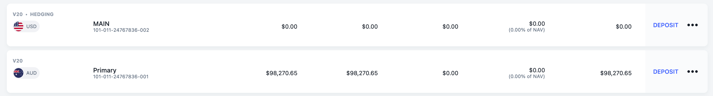
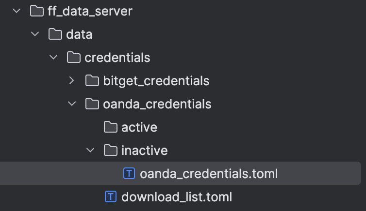

# Oanda Setup
## Live Trading Will be Available Soon.

Please be aware no live trading functionality has been tested, Oanda accounts are in alpha.

Accounts need to be non-hedging or you will have major issues.

Below is an example of a hedging and non hedging account.

Please do not use a hedging account.


## Credentials
In the following directory you need to setup the credential file, there is a template file in the `oanda_credentials/inactive`.
You need to fill it out and copy it into the `oanda_credentials/active` directory.

Only credentials files in active directories will be used by the server.



Depending on if you are using a live or practice account you input the mode as "practice" or "live" respectively
```toml
api_key = "your-api-key-here"
mode = "practice"  # "practice" or "live"
```

## Historical Data 
Not yet implemented for rithmic, coming asap, waiting for live rithmic account to activate with my broker)

Prop firms don't seem to have access to historical data.

To download historical data you need to add the symbols to your the download list for the specified brokerage.
The download list can be found in data/credentials/{Brokerage}_credentials/download_list.toml

The symbols should fund forge format, in fund forge `-` is used to replace `/` or `_` or any other symbols that are in the symbol name.
```toml
symbols = [
    "NAS100-USD",
]
```

Since we are downloading the lowest resolution data, the full Oanda data set would be about 80Gb from 2005 to current using 5 second quote bars.

Any symbols we specify in the `download_list.toml` file will be downloaded to the data directory, the historical data will be updated every 30 minutes as long as the server is running, 
or if we actively subscribe to data it will be updated each time a new subscription event occurs.

You don't need to stop the server to add new symbols to the download list, just add the symbols to the list and the server will start downloading the new symbols at the next download interval.

