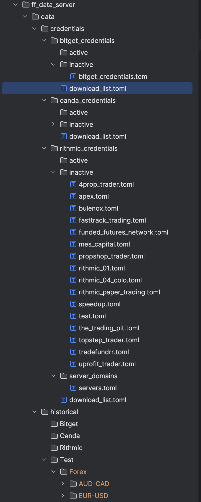

## Rithmic
To use the rithmic api, you have to apply for a dev kit from rithmic and pass conformance, this is just a matter of creating a unique app name to pass into the RithmicClient;

Then you just follow the information you will get from rithmic, which is essentially just:
1. Contact rithmic and get the [dev kit](https://www.rithmic.com/apis)
1. prepend a message to your app name. (do not use fund forge as app name, it is already used)
2. login with the api and stay connected to the rithmic test end point's while rithmic's engineers do some work approving your application name.
3. receive back information required to complete the rithmic toml files in fund forge.

Rithmic conformance is easy to pass just put the test details given to you by rithmic into a new .toml file at `ff_data_server/data/rithmic_credentials/active/test.toml`
You can find the template file in `ff_data_server/data/rithmic_credentials/inactive`, just fill it out and move it to the active folder.

Only credentials files in the `active` directories will be used by the server.

Then you will just need to start the data server and keep it running until rithmic passes you app (the server will keep itself connected to rithmic if your details are correct)

Since Fund Forge is not a company, each user must do this, you can find more information at [Rithmic](https://www.rithmic.com/apis).

## Rithmic Systems For Testing
I have had trouble logging in with rithmic paper accounts which are given by brokers, this is possibly because you are required to pay for the rithmic api with real brokerages.
You can use an online prop firm accounts without any problems.
Some prop firms do not want algo traders. 
Of all that I have spoken to TopStep seems to not have a problem with algo traders.
Be aware prop firms do not offer support for this platform, you should use RTrader to flatten and monitor accounts.

I am using:
- [Apex](https://apextraderfunding.com/member/aff/go/burnouttrader) I have an affiliate coupon: `LISUNZQY`
- [TopstepTrader](https://www.topsteptrader.com/) I have no affiliate yet.
- [TakeProfitTrader](https://takeprofittrader.com/) I have no affiliate yet.

## File Structure
The active folder will contain the credentials for the rithmic systems you intend to use.

You can store login details for other systems in the inactive folder, the server will not login to these connections.

You only need data active for 1 rithmic connection, unless you want multiple rithmic data feeds to use for `DataVendor` subscriptions.



For each rithmic RithmicSystem you intend to use, you will need to create a rithmic .toml file for the credentials.

You can set the variable `subscribe_data = false` if you only want to use the brokerage and not the data feeds for that system.

You will need to use the following folder/file structure

This is what you should call the files for each rithmic system.
```rust
pub enum RithmicSystem {
    Rithmic01,
    Rithmic04Colo,
    RithmicPaperTrading,
    TopstepTrader,
    SpeedUp,
    TradeFundrr,
    UProfitTrader,
    Apex,
    MESCapital,
    TheTradingPit,
    FundedFuturesNetwork,
    Bulenox,
    PropShopTrader,
    FourPropTrader,
    FastTrackTrading,
    Test
}

pub fn from_file_string(file_name: &str) -> Option<Self> {
    match file_name {
        "rithmic_01.toml" => Some(RithmicSystem::Rithmic01),
        "rithmic_04_colo.toml" => Some(RithmicSystem::Rithmic04Colo),
        "rithmic_paper_trading.toml" => Some(RithmicSystem::RithmicPaperTrading),
        "topstep_trader.toml" => Some(RithmicSystem::TopstepTrader),
        "speedup.toml" => Some(RithmicSystem::SpeedUp),
        "tradefundrr.toml" => Some(RithmicSystem::TradeFundrr),
        "uprofit_trader.toml" => Some(RithmicSystem::UProfitTrader),
        "apex.toml" => Some(RithmicSystem::Apex),
        "mes_capital.toml" => Some(RithmicSystem::MESCapital),
        "the_trading_pit.toml" => Some(RithmicSystem::TheTradingPit),
        "funded_futures_network.toml" => Some(RithmicSystem::FundedFuturesNetwork),
        "bulenox.toml" => Some(RithmicSystem::Bulenox),
        "propshop_trader.toml" => Some(RithmicSystem::PropShopTrader),
        "4prop_trader.toml" => Some(RithmicSystem::FourPropTrader),
        "fasttrack_trading.toml" => Some(RithmicSystem::FastTrackTrading),
        "test.toml" => Some(RithmicSystem::Test),
        _ => None,
    }
}
```

***After passing conformance: If the servers.toml is not already in your repo.***
You will need to populate the servers.toml file at ff_data_server/data/rithmic_credentials and fill in the server domains given to you by rithmic.
this is to generate a BTreeMap for Servers where Key is RithmicServer (eg: RithmicServer::Chicago) and value is the domain (eg: wss://{DETAILS_FROM_RITHMIC})
`ff_data_server/data/rithmic_credentials/server_domains/servers.toml`
```toml
[rithmic_servers]
Chicago = "You need to contact rithmic for this"
Sydney = "You need to contact rithmic for this"
SaoPaolo = "You need to contact rithmic for this"
Colo75 = "You need to contact rithmic for this"
Frankfurt = "You need to contact rithmic for this"
HongKong = "You need to contact rithmic for this"
Ireland = "You need to contact rithmic for this"
Mumbai = "You need to contact rithmic for this"
Seoul = "You need to contact rithmic for this"
CapeTown = "You need to contact rithmic for this"
Tokyo = "You need to contact rithmic for this"
Singapore = "You need to contact rithmic for this"
Test = "You need to contact rithmic for this"
```

For each RithmicSystem system you intend to use you will need a RithmicCredentials file in `ff_data_server/data/rithmic_credentials/active`
The templates files can be found in `ff_data_server/data/rithmic_credentials/inactive`

## Historical Data
To download historical data you need to add the symbols to your the download list for the specified brokerage.
The download list can be found in data/credentials/{Brokerage}_credentials/download_list.toml

The symbols should fund forge format, in fund forge `-` is used to replace `/` or `_` or any other symbols that are in the symbol name.
```toml
symbols = [
    "MNQ",
]
```

Since we are downloading the lowest resolution data, the full Oanda data set would be about 80Gb from 2005 to current using 5 second quote bars.

Any symbols we specify in the `download_list.toml` file will be downloaded to the data directory, the historical data will be updated every 30 minutes as long as the server is running,
or if we actively subscribe to data it will be updated each time a new subscription event occurs.

You don't need to stop the server to add new symbols to the download list, just add the symbols to the list and the server will start downloading the new symbols at the next download interval.