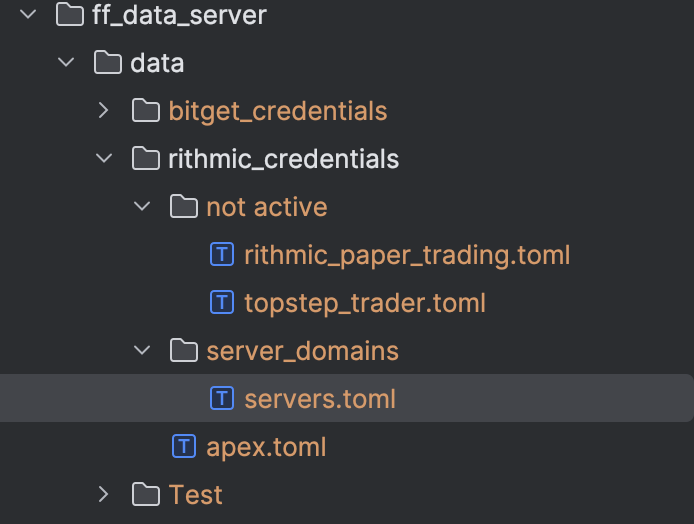
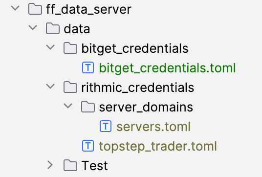

## Rithmic
To use the rithmic api, you have to apply for a dev kit from rithmic and pass conformance, this is just a matter of creating a unique app name to pass into the RithmicClient;

Then you just follow the information you will get from rithmic, which is essentially just:
1. prepend a message to your app name. (do not use fund forge as app name, it is already used)
2. login with the api and stay connected to the rithmic test end point's while rithmic's engineers do some work approving your application name.
3. receive back information required to complete the rithmic toml files in fund forge.

***If you are using the data server to pass conformance, you will need to set up the `ff_data_server/data/rithmic_credentials/server_domains/servers.toml` file below, and input only the TEST domain name for now.***

Rithmic conformance is easy to pass just put your test details into a new .toml file at `ff_data_server/data/rithmic_credentials/test.toml` (see below for toml file examples)
Then you will just need to start the data server and keep it running until rithmic passes you app (the server will keep itself connected to rithmic if your details are correct)

Since Fund Forge is not a company, each user must do this and create their own unique app name to pass conformance. You can find more information at [Rithmic](https://yyy3.rithmic.com/?page_id=17).

## File Structure
You do not need the `not active` folder, this is where i put tomls that i dont want the server to activate or connect to



***After passing conformance:***
You will need to create a servers.toml file at ff_data_server/data/rithmic_credentials and fill in the server domains given to you by rithmic.
this is to generate a BTreeMap for Servers where Key is RithmicServer (eg: RithmicServer::Chicago) and value is the domain (eg: wss://{DETAILS_FROM_RITHMIC})
`ff_data_server/data/rithmic_credentials/server_domains/servers.toml`
```toml
[rithmic_servers]
Chicago = "You need to contact rithmic for this"
Sydney = "You need to contact rithmic for this"
SaoPaolo = "You need to contact rithmic for this"
Colo75 = "You need to contact rithmic for this"
Frankfurt = "You need to contact rithmic for this"
HongKong = "You need to contact rithmic for this"
Ireland = "You need to contact rithmic for this"
Mumbai = "You need to contact rithmic for this"
Seoul = "You need to contact rithmic for this"
CapeTown = "You need to contact rithmic for this"
Tokyo = "You need to contact rithmic for this"
Singapore = "You need to contact rithmic for this"
Test = "You need to contact rithmic for this"
```

For each rithmic RithmicSystem you intend to use, you will need to create a rithmic .toml file for the credentials.

You will need to use the following folder/file structure



for each RithmicSystem system you intend to use you will need  RithmicCredentials file in ff_data_server/data/rithmic_credentials.
The file name is created using `credentials.system_name.file_string()`. This allows the credentials to be found by the data server.

save the toml file as `ff_data_server/rithmic_credentials/credentials.system_name.file_string();`
```rust

pub fn example() {
    let credentials = RithmicCredentials {
        user: "Example trader".to_string(),
        server_name: RithmicServer::Chicago,
        system_name: RithmicSystem::TopStep,
        app_name: "fufo:example".to_string(),
        app_version: "1.0".to_string(),
        password: "password".to_string(),
        fcm_id: "TopstepTrader".to_string(),
        ib_id: "TopstepTrader".to_string(),
        user_type: 1,
        subscribe_data: true,
        aggregated_quotes: false //this always has to be false, for some reason rithmic server will not parse true on login. I am not sure what is going on here.
    };
    
    //if you have aggregated_quotes == true you will get this message
    //ResponseLogin { template_id: 11, template_version: None, user_msg: [], rp_code: ["11", "an error occurred while parsing data."], fcm_id: None, ib_id: None, country_code: None, state_code: None, unique_user_id: None, heartbeat_interval: None }


    // Note that we use credentials.system_name.file_string() for the file name, so that the server knows where to find credentials.
    let save_path: String = format!("ff_data_server/rithmic_credentials/{}", credentials.file_name());
    credentials.save_credentials_to_file(&save_path);
}
```
Rithmic Credentials toml file example
user type 3 = Trader, this is important for prop firm connections.

### For TopStep
The file name should be rithmic_credentials/topstep_trader.toml
```toml
user = ""  
system_name = "TopstepTrader"  
server_name = "Chicago"
app_name = "{The app name you used for rithmic conformance}"
app_version = "1.0"  
password = ""  
fcm_id = "TopstepTrader"  
ib_id = "TopstepTrader"  
user_type = 3
subscribe_data = true
aggregated_quotes = true
```

### For Apex Trader Funding
The file name should be rithmic_credentials/apex.toml
```toml
user = ""
system_name = "Apex"
server_name = "Chicago"
app_name = "{The app name you used for rithmic conformance}"
app_version = "1.0"
password = ""
fcm_id = "Apex"
ib_id = "Apex"
user_type = 3
subscribe_data = true
aggregated_quotes = false
```

### For Take Profit Trader
The file name should be rithmic_credentials/rithmic_paper_trading.toml
```toml
user = ""
system_name = "RithmicPaperTrading"
server_name = "Chicago"
app_name = "{The app name you used for rithmic conformance}"
app_version = "1.0"
password = ""
fcm_id = "TakeProfitTrader"
ib_id = "TakeProfitTrader"
user_type = 3
subscribe_data = true
aggregated_quotes = false
```